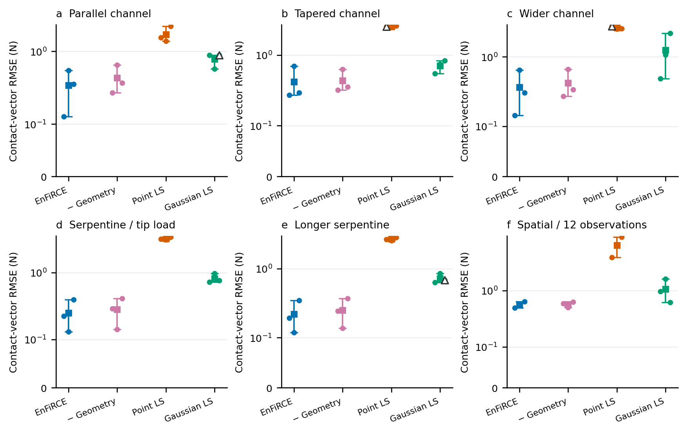
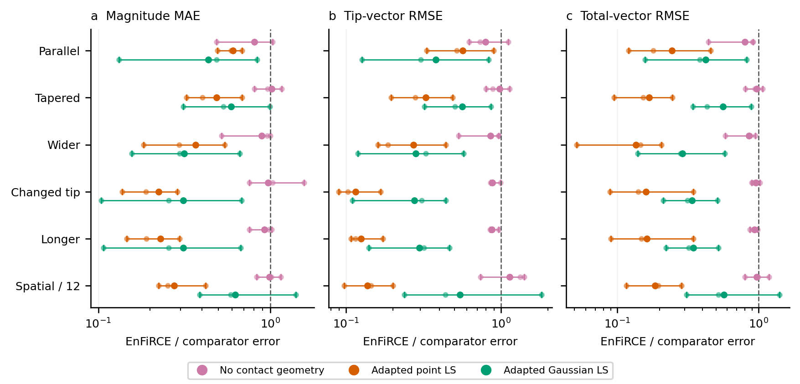
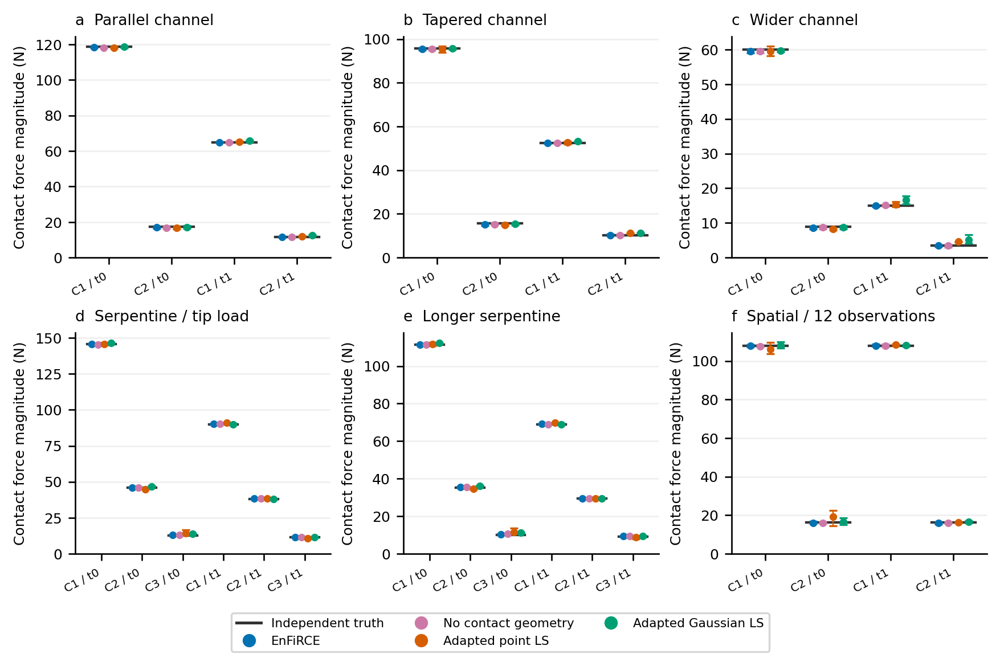
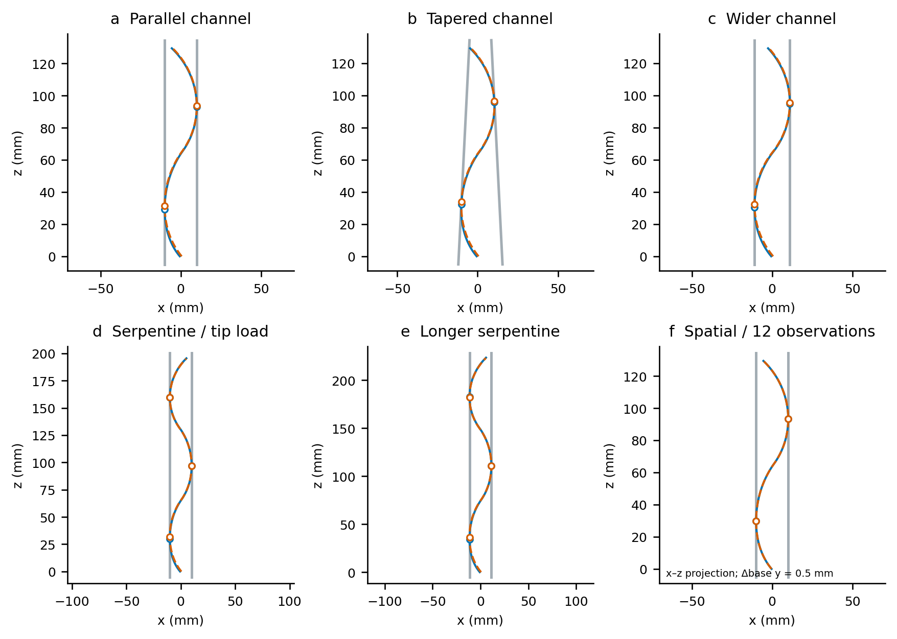

# 新配置的同观测力估计比较

更新：2026-10-05。

实际记录 72 次运行：6 配置 × 3 传感器种子 × 4 方法。异常 0 次。结果来自新的独立配置或明确标注的观测密度控制；不是插值视频或论文报告数值搬运。

## 1. 比较协议

曲率噪声 SD 2.5e-5 /mm，同时按观测包的平面协方差采样位置/法向噪声：位置分量 SD 0.05 mm、法向分量 SD 0.001，法向随后单位化。种子为 11、23、37；同维数配置使用共同标准噪声。每个固定配置的三个观测实现独立，但不是三条机器人轨迹。

每份 input.mat 与 truth.mat 的字节在四种方法间相同。真值从未送入逆模型；候选来自观测。full 和 no_geometry 都保留完整 3-D Cosserat 窗口、前一时刻平衡、独立末端力与潜在环境参数；后者只去掉接触 gap/tangency/nonpenetration。Point LS / Gaussian LS 为项目中的文献思想适配，保留既有三个独立初值、每初值 80 次迭代，不接受 EnFiRCE 解初始化；共享观测候选数量，使用自己的固定有序弧长分区。它们省略环境/过程因素，故比较完整估计器的输入利用能力，不能称为信息量匹配的单一优化器竞赛。

下表均值按三个窗口计算；每个窗口内部计算两帧、所有匹配接触的向量 RMS。力大小 MAE 单独计算。非正退出/复核不删除，接触数不匹配时不给虚构的接触误差。

## 2. 全部方法结果

| 场景 | 方法 | 匹配/尝试 | 接触向量 RMSE /N | 力大小 MAE /N | 末端 RMSE /N | 总力 RMSE /N | 非正退出 |
|---|---|---:|---:|---:|---:|---:|---:|
| Parallel channel | EnFiRCE | 3/3 | 0.343137 | 0.3041 | 0.334255 | 0.377523 | 0 |
| Parallel channel | No contact geometry | 3/3 | 0.429568 | 0.375675 | 0.421934 | 0.473846 | 0 |
| Parallel channel | Adapted point LS | 3/3 | 1.71494 | 0.500357 | 0.590781 | 1.54801 | 0 |
| Parallel channel | Adapted Gaussian LS | 3/3 | 0.783189 | 0.698441 | 0.88265 | 0.892228 | 1 |
| Tapered channel | EnFiRCE | 3/3 | 0.42052 | 0.379571 | 0.44852 | 0.451542 | 0 |
| Tapered channel | No contact geometry | 3/3 | 0.435444 | 0.373149 | 0.459028 | 0.465209 | 0 |
| Tapered channel | Adapted point LS | 3/3 | 2.53803 | 0.777742 | 1.37712 | 2.67593 | 1 |
| Tapered channel | Adapted Gaussian LS | 3/3 | 0.711112 | 0.64011 | 0.796984 | 0.804587 | 0 |
| Wider channel | EnFiRCE | 3/3 | 0.364335 | 0.325192 | 0.371401 | 0.380202 | 0 |
| Wider channel | No contact geometry | 3/3 | 0.422065 | 0.365619 | 0.435368 | 0.444252 | 0 |
| Wider channel | Adapted point LS | 3/3 | 2.60754 | 0.887004 | 1.36169 | 2.79974 | 1 |
| Wider channel | Adapted Gaussian LS | 3/3 | 1.2454 | 1.02883 | 1.3232 | 1.31217 | 0 |
| Serpentine / tip load | EnFiRCE | 3/3 | 0.248934 | 0.207831 | 0.284407 | 0.351695 | 0 |
| Serpentine / tip load | No contact geometry | 3/3 | 0.280073 | 0.213887 | 0.323845 | 0.368963 | 0 |
| Serpentine / tip load | Adapted point LS | 3/3 | 3.18742 | 0.929226 | 2.46602 | 2.20904 | 0 |
| Serpentine / tip load | Adapted Gaussian LS | 3/3 | 0.815634 | 0.668374 | 1.03075 | 1.03973 | 0 |
| Longer serpentine | EnFiRCE | 3/3 | 0.2195 | 0.185008 | 0.268692 | 0.312564 | 0 |
| Longer serpentine | No contact geometry | 3/3 | 0.251279 | 0.200053 | 0.308726 | 0.334276 | 0 |
| Longer serpentine | Adapted point LS | 3/3 | 2.6653 | 0.80639 | 2.15892 | 1.93303 | 0 |
| Longer serpentine | Adapted Gaussian LS | 3/3 | 0.720067 | 0.592151 | 0.903022 | 0.907306 | 1 |
| Spatial / 12 observations | EnFiRCE | 3/3 | 0.55495 | 0.52804 | 0.586632 | 0.641058 | 0 |
| Spatial / 12 observations | No contact geometry | 3/3 | 0.56957 | 0.535655 | 0.517214 | 0.659547 | 0 |
| Spatial / 12 observations | Adapted point LS | 3/3 | 6.36049 | 1.91758 | 4.27756 | 3.46011 | 0 |
| Spatial / 12 observations | Adapted Gaussian LS | 3/3 | 1.06135 | 0.843507 | 1.08174 | 1.12759 | 0 |



方形标记和线段为三个种子的均值及最小/最大范围，圆点为每个种子；范围不是置信区间。纵轴 symlog 在 0.1 N 以下线性，以上为对数。空心三角标记非正退出，并保留在统计中。



辅助误差图的中心是 EnFiRCE 三种子均值 / 对照方法三种子均值，点和范围为逐种子配对比值。小于 1 表示该指标完整法误差更低，大于 1 的结果同样保留；范围不是置信区间。

## 3. 各接触的实际力大小



灰线为独立 shooting 真值，彩点及范围为各方法三个种子的估计。C1/C2/C3 按材料弧长排序，t0/t1 是实际独立求解的两个平衡。单位为 N，采用项目当前校准刚度，不能解释为硬件测量。

## 4. 物理配置与实现



- parallel_channel：140 mm S 形杆、两壁 x=±10 mm，两接触，基座从 x=-0.6 至 +0.6 mm，独立末端力 [0.1,0,-0.08] N。
- tapered_channel：同长度，非平行法向 [1,0,-0.05] / [-1,0,-0.05] 经单位化，真实两接触。
- wider_channel：两壁 x=±11 mm，末端力变为 [0.15,0,-0.10] N；重新求解真值。
- serpentine_tip_load：210 mm 三接触蛇形杆，末端力变为 [0.25,0,-0.15] N。
- longer_serpentine：210 mm 配置按 8/7 几何缩放为 240 mm；段长 80 mm、曲率 0.0175 /mm、壁距和基座移动同样缩放；保持刚度，载荷按 (7/8)^2 缩放。这是相似几何尺度对照，不是新接触拓扑。
- spatial_sparse：旧真实 3-D 双接触滑动真值，µ=0.03，基座 +y 0.5 mm，末端力 [0.1,0.3,-0.08] N；仅将 24 个观测位置均匀减为 12 个。几何图为 x-z 投影，不冒充新的物理轨迹或 stick-slip。

前五项用独立连续平面 shooting 生成新平衡，再嵌入 3-D 观测；逆模型仍使用非线性 3-D Cosserat。每次构造检查整杆穿透、接触 gap/tangency、端部力矩和平衡。240 mm 的第一次配置保持 20 mm 通道不变，整杆穿透 1.95 mm，审计拒绝，未进入估计排名；拒绝记录保留在 fixture_diagnostics.json。

代码对应：

| 部分 | 实现 |
|---|---|
| 六场景定义、独立输出、同输入方法循环、SHA/恢复 | [run_generalization_comparison.m](../rod/run_generalization_comparison.m) |
| 连续平面真值 | [build_multi_contact_demo_truth.m](../rod/build_multi_contact_demo_truth.m)、[solve_planar_multi_contact.m](../rod/solve_planar_multi_contact.m) |
| 真正空间摩擦真值 | [build_spatial_friction_packet.m](../rod/build_spatial_friction_packet.m) |
| 完整窗口 MAP、协方差和质量标志 | [estimate_formulation_window.m](../rod/estimate_formulation_window.m) |
| 观测候选与跨帧关联 | [formulation_contact_candidates.m](../rod/formulation_contact_candidates.m) |
| 曲率文献适配基线 | [estimate_literature_curvature_baseline.m](../rod/estimate_literature_curvature_baseline.m) |
| 曲率/环境观测采样 | [resample_formulation_observations.m](../rod/resample_formulation_observations.m) |
| 活动接触匹配、力大小/向量/末端/总力误差 | [score_formulation_window.m](../rod/score_formulation_window.m) |
| 数据核验、配对、绘图与本报告 | [render_generalization_comparison.py](../scripts/render_generalization_comparison.py) |

## 5. 复现、结果解释与数据

```matlab
addpath('rod'); addpath(genpath('LCP-Continuum'));
ids={'parallel_channel','tapered_channel','wider_channel', ...
     'serpentine_tip_load','longer_serpentine','spatial_sparse'};
for i=1:numel(ids), run_generalization_comparison(ids{i}); end
```

```text
python scripts/render_generalization_comparison.py
```

实际运行按场景使用六个并行 MATLAB -singleCompThread 进程，计时包含局部协方差及共享资源；不能用来宣布隔离速度或实时性能。重复运行精确验证选项、来源及保存文件，配置/源码改变必须建立新版本，不能覆盖旧结果。此前 108 次因素与 36 次基线数据没有改写。

- [逐种子所有指标 CSV](../out/benchmarks/generalization/v1/source_data.csv)
- [每帧每接触真值和估计大小 CSV](../out/benchmarks/generalization/v1/force_data.csv)
- [机器可读配置及均值](../out/benchmarks/generalization/v1/summary.json)
- [来源与图表校验清单](../out/benchmarks/generalization/v1/plot_provenance.json)
- [首次不合法配置与修正说明](../out/benchmarks/generalization/v1/fixture_diagnostics.json)

优势结论应限定为本组保存的条件/输入与这两个适配基线；基线不是原作者官方实现。已有论文使用不同传感器、载荷、硬件及指标，不能直接按其论文中的误差大小排行。Point 的思想依据 [Xiao and Chen, 2021](https://arxiv.org/abs/2109.12469)，Gaussian 的依据 [Aloi et al., 2022](https://doi.org/10.1109/LRA.2022.3188905)。本组不改动完整平衡、摩擦或递归近似范围，也不把更多仿真样例说成已经证明全局 SOTA。
