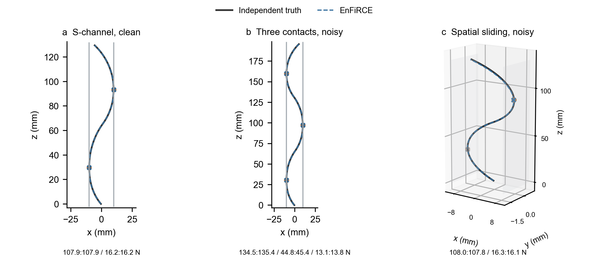
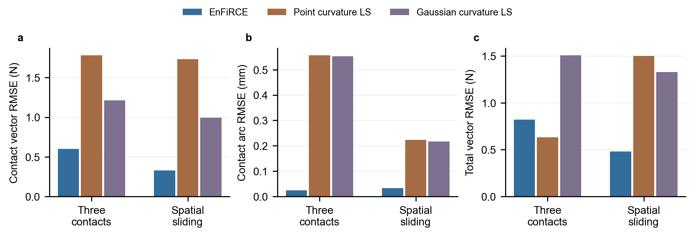
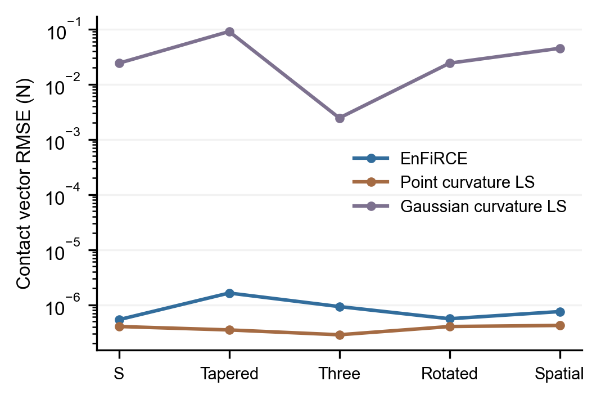
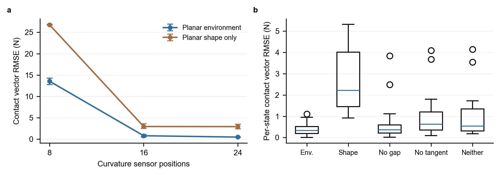

# 同观测文献基线、真实结果与求解加速

更新：2026-10-01。项目：**EnFiRCE: Environment- and Friction-informed Rod Contact Estimation**。

本轮已经实际完成七组相同输入下的点载荷/Gaussian 基线求解，共 14 次方法运行、28 个输出状态，无运行失败；与已有七组完整三维窗口的 14 个状态比较。两个含噪场景中，EnFiRCE 的逐接触向量与位置误差较低，但三接触的合力误差高于点载荷基线。结论是**这些输入下接触分力估计有优势，尚不能称为 SOTA**。

另完成一次相同冷启动、相同目标和约束的缓存开关消融。双接触两状态窗口的求解调用时间从 116.29 s 降到 50.75 s，力差为 0；这个改进减少重复积分，不简化 Formulation。它仍未达到实时预算。

## 1. 比较的具体问题

所有方法估计同一根杆的未知接触弧长、接触力与独立三维末端力。输入为 24 个材料弧长位置上的两个实际弯曲通道、相同标定杆参数、基座姿态、观测时刻与曲率协方差。EnFiRCE 另外使用环境平面观测、其协方差及摩擦系数，这是项目要研究的信息增益。两个基线的力似然不使用平面、接触真值、摩擦模式或稠密真值形状。

基线共享的是 EnFiRCE 从观测产生的**候选数 K**，不共享其接触位置初值、平面索引或估计力。这避免偷偷向基线给出真实接触数，也意味着比较是“相同候选数条件下”的载荷估计，不能评价未知接触数识别。每个基线自行按杆长分为 K 个有序弧长区间，用自身形状重建产生初值。

EnFiRCE 联合求解两个时刻的 MAP；基线独立逐帧求解，前一帧的自身结果仅用于下一帧多初值之一，不作为额外观测或过程因子。因此这是完整方法间比较，差异包含环境、摩擦与时间过程信息，不能只归因于“加了一个平面约束”。去掉单个因素的效果应看单独消融。

## 2. 文献来源与适配边界

| 来源 | 本轮实际实现 | 保留的核心 | 明确改变/未复现的部分 |
|---|---|---|---|
| [Xiao 与 Chen，2021，Efficient Force Estimation for Continuum Robot](https://arxiv.org/abs/2109.12469) | `method='point'` | 稀疏曲率最小二乘，未知点力大小与位置 | 推广到有本征曲率、非均匀刚度及扭转的完整局部坐标 Cosserat 方程；加入独立未知三维末端力；不是直杆专用简化公式的逐字复现 |
| [Aloi 等，RA-L 2022，Estimating Forces Along Continuum Robots](https://doi.org/10.1109/LRA.2022.3188905) | `method='gaussian'` | 原文式 (9)–(10) 的局部横向 Gaussian 载荷系列 | 原文位置观测似然改为当前实际两个弯曲通道；加入独立未知三维末端力；固定为共享候选数；没有复现原作者所有实验及载荷数选择 |
| [Ferguson 等，TRO 2024，Unified Shape and External Load State Estimation for Continuum Robots](https://doi.org/10.1109/TRO.2024.3360950) | 相关工作；旧杆参数/传感器密度场景另记 | 联合形状与载荷的概率估计提供研究背景 | 本轮 Gaussian LS **不是**该论文的 Gaussian-process batch 实现，不能给它贴 Ferguson 原方法标签 |
| [Chen 等，Soft Robotics 2026，mixed external geometric constraints](https://doi.org/10.1177/21695172251388226) | 相关工作 | 已有研究也利用几何约束进行形状/接触估计 | 使用驱动模型、混合几何与真实机器人；未在本轮同输入完整复现，不能声称本项目首次使用形状和环境 |
| [Prakash、Vela 与 Tsiotras，2026，Gaussian-Parameterized Factor Graphs](https://arxiv.org/abs/2606.29165v2) | 最新相关工作 | 多接触 Gaussian 参数化因子图 | 包含应变、腱张力和位姿输入，本轮没有实现其完整随机杆/驱动图；当前 Gaussian 曲率 LS 不是该方法 |
| [Ferguson、Kuntz 与 Hermans，2026，Actuation Uncertainty](https://arxiv.org/abs/2601.04493v3) | 最新相关工作与加速路线 | 离散 Cosserat、稀疏因子图、驱动不确定性 | 不是本轮连续 shooting 的性能基线；原文的实时声明不能用来替代本项目的实测时间 |

这些条目均有真实论文主页或 DOI。这里的点载荷/Gaussian 方法是**可查看源码的文献适配实现**，不是原作者官方代码，也不是覆盖全部论文设定的复现。不同论文使用的机器人、传感器、载荷大小与误差定义不同，不把它们的硬件百分比误差与本项目仿真 RMSE 直接排名。

## 3. 新局部坐标力学映射：为什么没有偷偷简化

代码：[integrate_body_load_curvature.m](../rod/integrate_body_load_curvature.m)。设世界坐标内力矩为 m，内力为 N，杆姿态为 R；定义局部量 h=Rᵀm、n=RᵀN。无剪切、不可伸长杆满足：

```text
u(s) = u0(s) + K(s)^(-1) h(s)
h'(s) = -u(s) × h(s) - e3 × n(s)
n'(s) = -u(s) × n(s) - q_local(s)
h(L) = 0, n(L) = f_tip_local
```

这是世界坐标 `m'=-p'×N`、`R'=R hat(u)` 的坐标变换，不是线性小挠度近似。对点力，在从末端向基座积分跨过接触位置时向 n 加局部接触力；对 Gaussian，q_local 是连续体载荷。六状态反向积分直接得到所有弧长的曲率，不需要在每一次最小二乘试探中射击基座力矩。最后再由同一 u 正向积分 R、p，将估计力变换到世界坐标。

实现保留杆标定的本征曲率、分段弯曲/扭转刚度和未直接观测的扭转响应。在标定跳变与点力位置处明确分段；窄 Gaussian 的中心及 ±3σ、±6σ 处也分段，避免自适应 ODE 跨过窄载荷峰。查询曲率使用连续 ODE 解，不只在画图节点插值。默认 ODE 相对容差 2e-8。

Gaussian 的第 j 项为归一化的截断密度乘局部横向幅值 `[a_x,a_y,0]`，中心在其弧长分区内，σ 通过 log 参数估计、界为 **0.25 mm 到 L/3**。归一化使幅值单位为 N；正向计算世界坐标合力时积分 `R(s) q_j(s)`，不会把局部幅值直接冒充世界力。该宽度下界和横向参数化会使点载荷真值出现有限宽度/轴向分量失配，干净结果里的残差不能全归因于优化器。

点载荷方法允许三个局部分力；Gaussian 每项允许两个局部横向分力。两者均允许未知的三个局部末端分力，最终转换为世界坐标。杆身幅值边界为各局部分量 ±1000 N，末端为 ±10 N；EnFiRCE 则约束法向力 ≤200 N、世界末端各分量 ±25 N。这些边界不是完全相同的正则化，当前真实载荷未触及这些上界，但候选数、参数化与先验仍须在解释性能时说明。

## 4. 优化实现和文件职责

| 实现 | 具体职责 |
|---|---|
| [estimate_literature_curvature_baseline.m](../rod/estimate_literature_curvature_baseline.m) | 读取同一真实曲率通道/协方差；自身形状初始化；未知载荷/弧长/Gaussian 宽度的逐帧非线性最小二乘 |
| [integrate_body_load_curvature.m](../rod/integrate_body_load_curvature.m) | 六状态反向完整力学映射及最终正向位姿；返回世界坐标各项合力 |
| [run_literature_baseline_protocol.m](../rod/run_literature_baseline_protocol.m) | 先验证参考输入/真值/估计 SHA；估计器完成之后才载入真值评分；输出 MAT、CSV、JSON 与源码记录 |
| [score_formulation_window.m](../rod/score_formulation_window.m) | 按有序接触一一配对，计算接触向量 RMSE、大小 MAE、位置 RMSE、末端及合力 RMSE；接触数不匹配时不伪造分力匹配 |
| [audit_formulation_window_fit.m](../rod/audit_formulation_window_fit.m) | 用实际曲率通道数和观测噪声尺度进行拟合复核；不是独立真值准确性判定 |
| [export_literature_geometry.m](../rod/export_literature_geometry.m) | 校验参考窗口 SHA，直接读取已完成的杆形、接触位置、平面和力，导出场景绘图 JSON |
| [render_literature_comparison.py](../scripts/render_literature_comparison.py) | 校验已完成结果和文件 SHA；导出 21 行绘图源数据、四张 PDF/SVG/PNG 图和 LaTeX 表格 |
| [test_body_load_curvature.m](../rod/test_body_load_curvature.m) | 对独立 planar shooting 真值验证局部/世界坐标完整力学一致性、力坐标变换和 Gaussian 对形状的实际影响 |

基线目标残差为实际曲率误差的完整协方差白化，加幅值/1e6 的极弱零力正则。三个弧长初值分别置于各自分区的 25%、50%、75%；按初始残差排序，每个最多 80 次迭代、12000 次函数评估，使用中心差分。第二帧额外加入前一帧自身解。只有正退出且目标低于 1e-6 的无噪声数值一致解才提前结束多初值搜索。初值的线性 moment fit 用 ridge 1e-3；这个 ridge 只产生初值，不进入最终观测似然。

基线的 review 来自非正优化退出或观测拟合警告。EnFiRCE 还检查平衡、几何、互补、候选歧义及缺失摩擦历史，若请求协方差还检查局部分力可辨识性。因此不能把各方法 review 数的差异当成完全相同的分类指标。新代码对已知积分超预算/非有限预测保留拒绝试探；其他编程错误与非法配置直接抛出，避免被大残差吞掉。

## 5. 已实际完成的含噪结果

接触向量 RMSE = `sqrt(mean_{j,k} ||f_est(j,k)-f_true(j,k)||²)`；位置 RMSE 为材料弧长误差；合力为所有杆身接触力与末端力的向量和。不是力大小差，也不是百分比误差。

| 场景 | 方法 | 接触向量 RMSE / N | 位置 RMSE / mm | 末端 RMSE / N | 合力 RMSE / N |
|---|---|---:|---:|---:|---:|
| 含噪三接触 | EnFiRCE | **0.600524** | **0.023535** | **0.780736** | 0.819888 |
| 含噪三接触 | Point curvature LS | 1.780640 | 0.556319 | 1.469319 | **0.631551** |
| 含噪三接触 | Gaussian curvature LS | 1.212155 | 0.552396 | 1.360766 | 1.506132 |
| 含噪空间滑动 | EnFiRCE | **0.330189** | **0.032197** | **0.351830** | **0.479752** |
| 含噪空间滑动 | Point curvature LS | 1.731838 | 0.223017 | 0.613029 | 1.499337 |
| 含噪空间滑动 | Gaussian curvature LS | 0.993874 | 0.217092 | 1.207353 | 1.329331 |

相对点载荷方法，两组接触向量 RMSE 分别降低约 66.3%、80.9%；相对 Gaussian 方法约降低 50.5%、66.8%。这些百分比是上述同输入数值的比值，不是跨论文评比。空间场景第一状态没有更早的摩擦平衡历史，仍保留 1/2 review。两个场景各两个状态、各只有一个噪声种子，不绘制虚构误差条或宣称统计显著性。

合力反例不能忽略：误差向量相加时可以抵消，所以更小的各接触误差不保证更小的总误差。无噪声五组中，点载荷方法也达到约 2.86e-7–4.23e-7 N；部分指标低于 EnFiRCE 的数值误差。Gaussian 接触 RMSE 为 0.00245–0.09068 N，包含有限宽度/局部横向参数化失配和局部优化影响；七组共有 6 个状态触发其复核。不能把干净场景里的“比数值零更小”当作机器人测力优势。

完整 21 组指标见[结果表](../out/benchmarks/literature/summary.md)、[机器可读结果](../out/benchmarks/literature/comparison.json)和[绘图源 CSV](../out/benchmarks/literature/source_data.csv)。每个场景目录保存 `point/estimate.mat`、`gaussian/estimate.mat` 及相应 `forces.csv`。

## 6. 图与已有消融的解释



场景图直接读取三组已完成窗口的第一个状态。黑线是真值杆形，蓝色虚线是估计杆形，点和叉分别是真实与估计接触位置；底部逐项列出真实:估计的接触力大小，单位 N。前两幅采用 x–z 投影，第三幅保留三维视角。真实接触点仅为显示而在真值稠密中心线上插值；这种绘图插值不参与估计。灰色线/片是无限平面模型在画面中的截取，不是有限障碍物。完整场景数据及其输入、真值、估计的 SHA 见 [geometry.json](../out/benchmarks/literature/geometry.json)。这是求解结果的可视化，不是重新运行的轨迹视频。







最后一张图读取已有 **396 次二维有序接触原型**的结果，不冒充完整三维摩擦窗口的多种子重复。左图使用标称噪声下每个 seed 的状态级 RMSE 平方均值开方，绘制三个 seed 的平均及最小/最大范围；场景接触数不同时仍对状态等权，不是把所有接触按数量加权。右图各条件 18 个状态，箱体为描述性四分位数、显示全部离群点；状态相关，不作显著性检验。图中“Neither”删除 gap 与 tangency 罚项，但仍保留环境法向参数化与初始化；它不是独立 shape-only 基线。

所有图提供可编辑文字的 SVG、矢量 PDF 与 PNG 预览。图稿来源和统计定义见 [provenance.json](../out/benchmarks/literature/figures/provenance.json)。

## 7. 修复重复积分：精确缓存而不是近似缓存

代码：[estimate_formulation_window.m](../rod/estimate_formulation_window.m) 的嵌套 `decode`。原实现只缓存整个优化向量；有限差分改变某一帧或平面点，就会让所有帧再次积分。现在每帧独立保存最多八项 LRU 缓存，其 key 为：

```text
[world_base_moment(3); ordered_contact_arcs(K);
 world_contact_force(3*K); world_tip_force(3)]
```

同一估计调用内杆标定、基座姿态和时刻固定；这些量按帧隔离。只有上述 key **逐元素完全相等**才复用形状与预测曲率，不四舍五入、不用“接近”的状态代替当前状态。改平面点或某些 dual slack 不改变力学状态时可命中；改平面法向若改变了世界接触力则不会误命中。每次仍重新计算当前几何、整杆 gap、摩擦锥与由前驱完整平衡产生的同一材料点位移。

公开选项 `cacheMechanics=false` 可关闭；默认 true。`solver.mechanicalEvaluations` 与 `solver.mechanicalCacheHits` 记录真实调用数。状态、MAP、摩擦、求解容差、物理审计均保持原定义。

| 相同冷启动窗口 | 关闭缓存 / s | 开启缓存 / s | ODE 调用数：关 → 开 | 最大力差 / N |
|---|---:|---:|---:|---:|
| 无杆身接触 | 3.1312 | 1.1883 | 754 → 210 | 0 |
| 双接触 | 116.2865 | 50.7523 | 28322 → 11243 | 0 |

两组目标与全部质量字段也相同。双接触单次实测约 2.29 倍速度、56.4% 时间减少；关闭先、开启后的固定顺序可能受 JIT/热身影响，未做重复时间置信区间，因此只报告这次试验。计时是完整 `estimate_formulation_window` 调用，关闭协方差，排除 MATLAB 启动、真值生成与 I/O。原始七组 EnFiRCE 与这次基线的历史优化计时不具备统一条件，**不用于算法速度排名**。

运行与原始数据：[缓存消融](../out/benchmarks/mechanics_cache/comparison.json)。这没有把算法变成 20 ms 实时控制器；下一步加速需解析/自动微分灵敏度、稀疏窗口及递归边缘化。

## 8. 版本与复现

参考窗口运行 ID：`2530e6e5-741c-4337-8a23-221aaefb496b`，求解源码对应 Git `813cdfb`。本轮基线 ID：`6d9ee3b2-eeea-4747-a943-f374b50b71be`；缓存 ID：`a1cc2b7e-9b94-43cd-93df-1a317a6f354f`。两个新实验在提交前冻结的 160 个源码文件与当时工作区逐文件匹配，算法代码已保存在 Git `d2fc5ae`。之后的选项/错误处理改进不回写旧运行记录；实际运行版本按 JSON 的源码 SHA 追踪。

发布时还修正了跨平台复现问题：Windows 的 `core.autocrlf=true` 会把 MATLAB 写出的 CSV 在 Git 中改为 LF，导致记录的 SHA 与克隆后的文件不同。[.gitattributes](../.gitattributes) 对 `out/**` 禁用行尾转换，保存实际生成的 CSV/JSON/MAT 字节；已有归档也按原工作区字节重新保存。指标和原始运行记录不因这项修复而重算。

```matlab
addpath('rod');
addpath(genpath('LCP-Continuum'));

force('literature-baselines');        % 正式七组；读取已发布参考窗口
force('literature-baselines',true);   % 独立 smoke 路径，不覆盖正式结果
run_formulation_cache_benchmark();    % 两组 cache on/off，连续运行
test_body_load_curvature();           % 新局部力学与独立真值一致性
export_literature_geometry();         % 从已完成参考窗口导出实际场景图数据
```

```text
python scripts/render_literature_comparison.py
python scripts/render_notes.py docs/LITERATURE_COMPARISON.md
```

MATLAB R2024a、Optimization Toolbox 与固定 `LCP-Continuum` 依赖版本沿用 README。正式实验会重新写正式目录；只想查看成果时打开已有 JSON/CSV/图即可。基础检查的历史 33/33 记录保留；新力学检查另外已通过并加入检查入口，下一次完整 `force('check')` 将注册 34 项，不能把旧账本改写成已经运行过 34 项。

## 9. 目前还不能作出的结论与后续优先级

不是“代码再无问题”：遗漏环境面两组的总力 RMSE 17.83/15.96 N 仍保留，只是拟合诊断能提示异常；有限形状驱动候选、固定弧长分区与原型的稀疏观测失败也仍是算法边界。缓存不改变这些边界。对任意光滑曲面、有限面片、杆半径、真实黏滑切换和全局模式后验没有完整验证。

下一步的优先级是：完整三维窗口的独立多轨迹/多 seed 统计；以完全相同窗口因子进行环境/时间/摩擦逐项消融；扩大候选覆盖并处理跨分区迁移；材料/几何失配下的后验校准；正式因子图方法在相同输入子集下的实现或明确不可比；重复且随机顺序的性能测量。真实 FBG、相机和力传感器标定仍需要硬件。现在已有可以审阅的完整算法、公开输入、真实对比图与论文草稿，距离“已经证明可发表/最优”仍缺这些证据。
