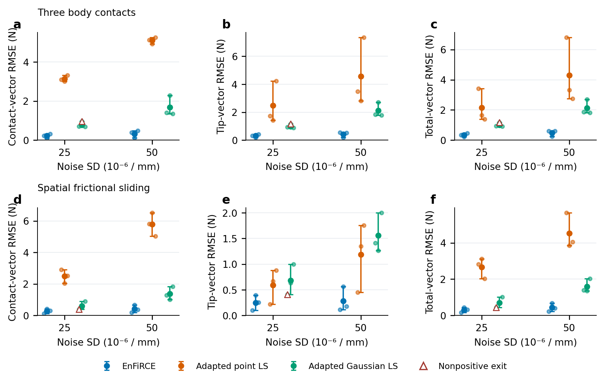
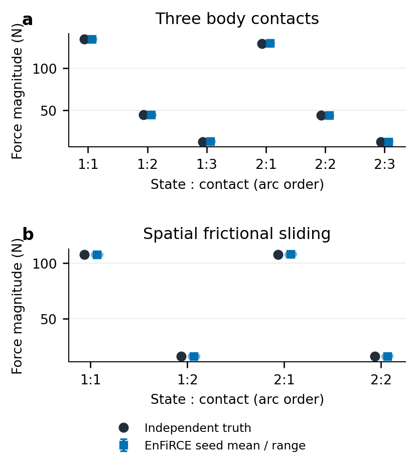

# 完整三维软件实验与论文结果

更新：2026-10-05。

本轮仍然研究：从稀疏形状与环境信息分离杆身接触力和独立末端力。全部统计来自完整三维 Cosserat 时间窗口，历史二维结果单独保留。

完整协议 run `3ee78967-a1c8-4565-a3d0-b4c97cda85da`：108 次因素运行、36 次同输入基线、2 次导数对照、36 项工程检查全部完成。因素/基线异常为 0/0，非正最终退出窗口为 3/2；复核帧为 48/8。

## 1. 实验究竟重复了什么

两个固定两帧平衡：蛇形三接触、真正含出平面变形的摩擦滑动双接触。每帧 24 个位置、两个实际弯曲曲率通道。噪声 SD 为 0、2.5e-5、5e-5 /mm；每种条件的传感器种子为 11、23、37。无噪声的三个种子是相同观测的重复控制，并非三条独立轨迹。两个含噪等级共有 12 个含噪输入包；同一种子跨噪声等级复用标准化噪声，仅改变幅度，两个同维数场景也复用该随机流。每个固定条件内的三个种子是独立重复，跨条件的包不是全局独立样本。环境观测本轮保持固定，不把固定环境下的局部覆盖率称为含环境失配的覆盖率。

六种方法各从自己的形状初值开始，不用完整方法后验初始化消融。点载荷/Gaussian 基线读取字节相同的输入和真值归档；真值仅在求解结束后评分。数量来自观测候选，比较条件化于候选数，不是未知数量检测比赛。

## 2. 同输入的力估计

标称曲率噪声下，下面是三个种子的窗口向量 RMSE 均值（N）。窗口内部对所有匹配接触与两帧计算 RMS；均值是窗口 RMSE 的均值。总力为杆身各接触力与末端力的向量和。

| 场景 | 方法 | 接触力 | 末端力 | 总合力 |
|---|---|---:|---:|---:|
| Three contacts | EnFiRCE | 0.21518 | 0.299456 | 0.34106 |
| Three contacts | Adapted point LS | 3.14187 | 2.46924 | 2.14717 |
| Three contacts | Adapted Gaussian LS | 0.77969 | 0.988823 | 1.00374 |
| Spatial sliding | EnFiRCE | 0.287869 | 0.251308 | 0.31137 |
| Spatial sliding | Adapted point LS | 2.49059 | 0.589908 | 2.65526 |
| Spatial sliding | Adapted Gaussian LS | 0.607036 | 0.680688 | 0.709738 |

接触力均值：EnFiRCE 在 4/4 个场景/基线组合中较小；合力均值是 4/4。分别报告这些指标，不能用一个指标的优势代替所有指标的优势。三种子的最小/最大值用作范围，未声称统计显著。

### 2.1 每个接触究竟估计了多少力

标称噪声，每项按相同状态和弧长顺序配对；以下是力向量的大小，不能代替上面的向量误差。范围是三个噪声种子的最小/最大估计，绝对误差是三个大小误差的均值。

| 场景 | 状态 | 接触 | 真值 /N | 估计均值 /N | 种子范围 /N | 大小绝对误差均值 /N |
|---|---:|---:|---:|---:|---:|---:|
| Three contacts | 1 | 1 | 134.477 | 134.492 | 134.402–134.599 | 0.0666383 |
| Three contacts | 1 | 2 | 44.7602 | 44.9769 | 44.8698–45.1783 | 0.216715 |
| Three contacts | 1 | 3 | 13.0727 | 13.3392 | 13.1936–13.5753 | 0.266504 |
| Three contacts | 2 | 1 | 129.118 | 129.296 | 129.123–129.45 | 0.178225 |
| Three contacts | 2 | 2 | 44.0618 | 44.2207 | 43.9931–44.3589 | 0.204655 |
| Three contacts | 2 | 3 | 12.9575 | 13.1256 | 12.9444–13.2184 | 0.176852 |
| Spatial sliding | 1 | 1 | 107.976 | 107.703 | 107.324–108.036 | 0.312602 |
| Spatial sliding | 1 | 2 | 16.2526 | 16.0839 | 15.7429–16.4144 | 0.2766 |
| Spatial sliding | 2 | 1 | 107.976 | 108.14 | 107.985–108.409 | 0.164038 |
| Spatial sliding | 2 | 2 | 16.2526 | 16.3327 | 16.0681–16.5579 | 0.203042 |





力大小图显示每帧、每个接触的独立真值及三个种子的估计。约 134 N 的反力来自项目当前合成刚度与变形，不代表已测量的机器人载荷范围。比较其他论文的 N 级误差必须同时匹配载荷范围、传感器、真值和误差定义。

## 3. 完整三维逐因素消融

| 场景 | 噪声 SD /mm | 方法 | 接触 RMSE 均值 /N | 总力 RMSE 均值 /N | 复核帧 | 非正退出窗口 |
|---|---:|---|---:|---:|---:|---:|
| Spatial sliding | 0 | Friction cone only | 8.10563e-07 | 1.37758e-06 | 0 | 0 |
| Spatial sliding | 0 | EnFiRCE | 7.4933e-07 | 1.23744e-06 | 3 | 0 |
| Spatial sliding | 0 | Fixed arc partitions | 6.88915e-07 | 1.09475e-06 | 6 | 3 |
| Spatial sliding | 0 | No camera likelihood | 7.78322e-07 | 1.21562e-06 | 3 | 0 |
| Spatial sliding | 0 | No contact geometry | 7.82673e-07 | 1.24124e-06 | 3 | 0 |
| Spatial sliding | 0 | No temporal prior | 7.58931e-07 | 1.24271e-06 | 3 | 0 |
| Spatial sliding | 2.5e-05 | Friction cone only | 0.326149 | 0.351828 | 0 | 0 |
| Spatial sliding | 2.5e-05 | EnFiRCE | 0.287869 | 0.31137 | 3 | 0 |
| Spatial sliding | 2.5e-05 | Fixed arc partitions | 0.287867 | 0.311368 | 3 | 0 |
| Spatial sliding | 2.5e-05 | No camera likelihood | 0.497326 | 0.647886 | 3 | 0 |
| Spatial sliding | 2.5e-05 | No contact geometry | 0.341496 | 0.364832 | 3 | 0 |
| Spatial sliding | 2.5e-05 | No temporal prior | 0.491551 | 0.559037 | 3 | 0 |
| Spatial sliding | 5e-05 | Friction cone only | 0.498996 | 0.538322 | 0 | 0 |
| Spatial sliding | 5e-05 | EnFiRCE | 0.410663 | 0.438174 | 3 | 0 |
| Spatial sliding | 5e-05 | Fixed arc partitions | 0.410669 | 0.43816 | 3 | 0 |
| Spatial sliding | 5e-05 | No camera likelihood | 0.719205 | 0.831529 | 3 | 0 |
| Spatial sliding | 5e-05 | No contact geometry | 0.559641 | 0.583776 | 3 | 0 |
| Spatial sliding | 5e-05 | No temporal prior | 0.93366 | 1.06857 | 3 | 0 |
| Three contacts | 0 | Friction cone only | 8.20308e-07 | 1.02844e-06 | 0 | 0 |
| Three contacts | 0 | EnFiRCE | 9.10833e-07 | 1.19627e-06 | 0 | 0 |
| Three contacts | 0 | Fixed arc partitions | 8.3013e-07 | 1.09782e-06 | 0 | 0 |
| Three contacts | 0 | No camera likelihood | 9.60736e-07 | 1.26365e-06 | 0 | 0 |
| Three contacts | 0 | No contact geometry | 3.72485e-06 | 4.48065e-06 | 0 | 0 |
| Three contacts | 0 | No temporal prior | 6.74067e-07 | 8.50984e-07 | 0 | 0 |
| Three contacts | 2.5e-05 | Friction cone only | 0.215172 | 0.341047 | 0 | 0 |
| Three contacts | 2.5e-05 | EnFiRCE | 0.21518 | 0.34106 | 0 | 0 |
| Three contacts | 2.5e-05 | Fixed arc partitions | 0.215175 | 0.341054 | 0 | 0 |
| Three contacts | 2.5e-05 | No camera likelihood | 0.264986 | 0.42348 | 0 | 0 |
| Three contacts | 2.5e-05 | No contact geometry | 0.252706 | 0.343192 | 0 | 0 |
| Three contacts | 2.5e-05 | No temporal prior | 0.377514 | 0.558672 | 0 | 0 |
| Three contacts | 5e-05 | Friction cone only | 0.321487 | 0.480661 | 0 | 0 |
| Three contacts | 5e-05 | EnFiRCE | 0.321491 | 0.480648 | 0 | 0 |
| Three contacts | 5e-05 | Fixed arc partitions | 0.321491 | 0.480653 | 0 | 0 |
| Three contacts | 5e-05 | No camera likelihood | 0.444244 | 0.691506 | 0 | 0 |
| Three contacts | 5e-05 | No contact geometry | 0.417416 | 0.537588 | 0 | 0 |
| Three contacts | 5e-05 | No temporal prior | 0.627481 | 0.926879 | 0 | 0 |


`no_temporal` 仅移除过程先验；`cone_only` 移除前驱位移/最大耗散互补，保留摩擦锥；`no_geometry` 移除接触间隙、切向与整杆非穿透，保留法向/摩擦参数化；`no_camera` 仅移除环境似然；`legacy_partitions` 恢复首帧固定弧长分区。后两者仍保留其余因子和观测生成初值。某个场景没有触及旧分区时，两种弧长范围结果可以相同；这不能作为全长搜索提升精度的证据。代码的跨分区迁移回归用构造位置验证搜索域，未冒充独立物理轨迹实验。

## 4. 局部区间与计算代价

完整方法的含噪窗口共有 252/252 个可计分世界坐标力分量落入局部 95% 区间，另有 0 个未辨识分量；可计分区间平均全宽为 1.55149 N。分母包括匹配的活动接触力与末端力，不把无穷标准差计为覆盖成功；无噪声重复控制不计覆盖。相邻帧和各分量相关，12 个噪声实现只支持本固定轨迹/模式的条件诊断，不能声称全局校准。完整方法所有 18 个窗口共 9 帧需复核，其中 9 个空间首帧同时缺少真实摩擦前驱观测，保留静态锥并明确警告，不能伪造历史或把警告当作优化失败。


实际运行硬件：13th Gen Intel Core i9-13900HK (14 physical cores, 20 logical processors), 31.69 GiB visible RAM, Windows 11; MATLAB 24.1.0.2537033 (R2024a)。包含局部协方差的完整窗口调用：中位数 138.470 s，范围 114.647–311.925 s。因素矩阵按场景/种子分成六个单计算线程 MATLAB 进程，最多六个并行；0 个先前完成的组合保留其串行耗时。因此本矩阵的 wall time 是共享机器资源下的运行成本，不能当作隔离延迟，也不能据此对不同方法进行实时性能排名。36 个文献基线由先前单线程顺序阶段完成并原样复用。导数对照和历史回归重放采用 MATLAB 默认线程模式；旧 wall 重放在相同模式下保持原始严格容差。本轮导数对照在全部并行进程退出后，同机、相同冷启动、同协方差开关顺序执行：分开求导 37.635 s，共享求导 31.794 s，ODE 6817 → 6060 次；最大力差 8.28399e-15 N，最大弧长差 7.10543e-15 mm。只做一次、固定先后顺序，不作延迟显著性或实时声明。

## 5. 本轮修复了什么

- 逐帧合并、跨帧关联候选，避免同一接触迁移被误生成为多个槽。
- 全长有序弧长替代默认首帧固定分区，保留最小间距。
- 目标、约束与协方差共享同状态的中央差分矩阵，按帧复用力学，不近似替换平衡。
- 退化活动分支恢复时用弱原 MAP 残差防止观测形状漂移，再优化原 MAP；只在分支精化删除盒约束已覆盖的冗余行和恒等零行，最终审核原始互补条件。
- 分支约束容差与精确同伦目标统一为 1e-8，修正干净三接触点被 1e-9 内层容差与 1e-8 步长条件误拒绝的问题；保留原始审计和真实退出码，额外记录停止消息与一阶最优性。
- 区分非法优化试探与程序错误；非有限/越界试探可拒绝，真实维度错误继续抛出，避免 NaN 弧长进入 ODE。
- 整杆碰撞包含连续接触位置，评分只匹配活动接触，不把零力槽算成真接触。
- 恢复器重新计算固定残差的真实平方范数，只接受未变差的恢复点；不再让失败的最小二乘返回点覆盖原初值。原失败输入重放已确认这一保护恢复原 MAP 拟合。
- MATLAB 恢复保存的单项 struct 数组/对象、缺失覆盖诊断 null/[] 按明确字段规范化；所有数值、顺序、标志与文件 SHA 保持精确比较，三个 Python 回归检查覆盖合法往返、末位数值篡改和未声明字段。

- 数据、源码与发布文件保持字节校验，所有图从已完成数据生成。

## 6. 可以向学长展示与需要讨论的事

可以直接展示：本报告的配对表和力大小图、完整三维六因素图、技术总说明第 25–26 节，以及真实 12 状态 MP4。一起发送输入/真值/估计 MAT、forces.csv 和 comparison.json，可以逐项复算。

需要讨论：当前合成刚度导致反力较大，是否符合实际杆参数；无限平面与材料曲率校准是否符合学长的系统；哪些摩擦轨迹能真正区分完整历史模型与静态锥；末端力与接触力需要哪些硬件真值；官方因子图方法的输入如何匹配。

已有反例也要展示：历史遗漏墙面的总力误差 17.834/15.964 N，摩擦系数失配 1.647 N，二维 8 点观测失准，且某些指标/消融可能打平或优于完整法。这些是失配/信息条件边界，不应从网站或稿件隐藏。

## 7. SOTA 与论文状态

两种比较是公开源码的文献思想适配，不是原作者官方完整系统。BENDIER 的官方 RAL 标签已经查明，但依赖 GTSAM、Eigen 与特定图观测；本轮未运行它。Prakash 等 2026 年的多接触图输入还包含末端位置/腱信息，其发表数字不可直接排行。当前可以报告本数据和给定改编基线上的结果，不能宣布 SOTA。

论文目前是无作者信息的仿真稿，硬件校准、独立多轨迹、接触模式混合、材料/环境失配覆盖和实时运行仍需研究证据。软件流程完成并不使这些证据自动成立。

## 8. 复现与文件

```matlab
addpath('rod'); addpath(genpath('LCP-Continuum'));
force('publication');
```

```text
python scripts/render_formulation_publication.py
python scripts/update_publication_manuscript.py
python scripts/compile_publication_manuscript.py
python scripts/sync_publication_website.py
```

- [完整协议状态](../out/benchmarks/publication/completion.json)
- [108 次因素原始记录](../out/benchmarks/formulation_factors/comparison.json)
- [36 次基线原始记录](../out/benchmarks/formulation_literature/comparison.json)
- [配对绘图源 CSV](../out/benchmarks/publication/paired_source_data.csv)
- [力大小源 CSV](../out/benchmarks/publication/contact_magnitude_source_data.csv)
- [图表校验记录](../out/benchmarks/publication/figure_provenance.json)
- [论文 PDF](../out/benchmarks/publication/EnFiRCE_draft.pdf)
- [论文编译来源记录](../out/benchmarks/publication/manuscript_build.json)
- [导数性能对照](../out/benchmarks/formulation_derivatives/comparison.json)
- [总技术文档](TECHNICAL_OVERVIEW.md)

## 新配置比较

新增 72 次六配置同观测比较：曲率和平面观测同时采样，包含非平行通道、壁距/末端载荷、几何尺度与空间稀疏观测。全部逐种子指标、真实力大小、退出码、场景定义和代码对应见[新配置比较报告](GENERALIZATION_RESULTS.md)。既有冻结协议未改写；基线仍为文献思想适配。
