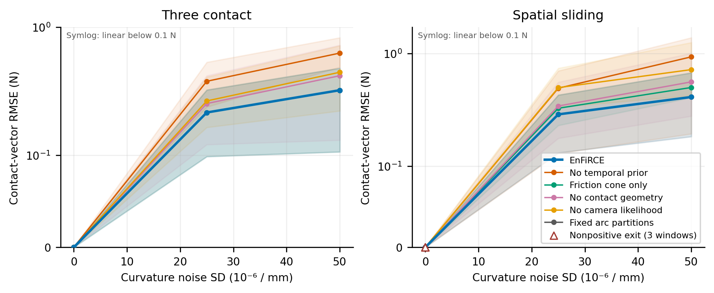
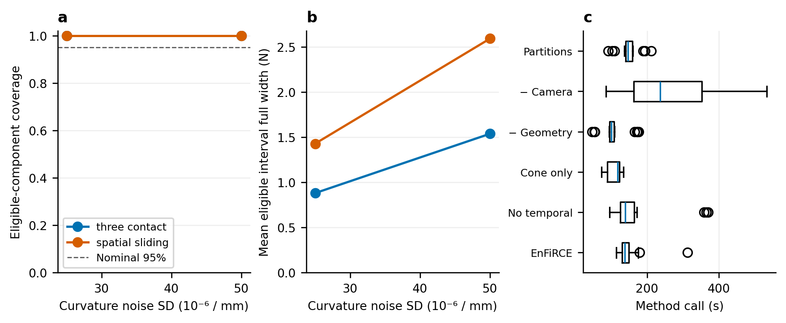

# 完整三维窗口因素实验

实际完成 108 次方法/观测包运行；run `573f22dd-fd5d-45b5-82a7-f0f45bf09984`。

每个固定两帧条件内有三个独立种子，标准化噪声跨等级/同尺寸场景共用，clean 控制相同。均值按种子计算，阴影是种子最小/最大值，不是置信区间。纵轴为 symlog，0.1 N 以下线性；叉号为观测拟合复核，空心三角标记非正最终退出（重叠控制的数量见图例）。接触数不匹配的窗口不进入接触误差均值，数量明确列出；总合力误差保留。

| 场景 | 噪声 SD /mm | 方法 | 有效窗口/全部 | 接触 RMSE 均值 / N | 总合力 RMSE 均值 / N | review 帧 | 非正退出窗口 | 覆盖分子/分母 | 未辨识分量 |
|---|---:|---|---:|---:|---:|---:|---:|---:|---:|
| spatial_sliding | 0 | Friction cone only | 3/3 | 8.10563e-07 | 1.37758e-06 | 0 | 0 | 0/0 | 0 |
| spatial_sliding | 2.5e-05 | Friction cone only | 3/3 | 0.326149 | 0.351828 | 0 | 0 | 54/54 | 0 |
| spatial_sliding | 5e-05 | Friction cone only | 3/3 | 0.498996 | 0.538322 | 0 | 0 | 54/54 | 0 |
| spatial_sliding | 0 | EnFiRCE | 3/3 | 7.4933e-07 | 1.23744e-06 | 3 | 0 | 0/0 | 0 |
| spatial_sliding | 2.5e-05 | EnFiRCE | 3/3 | 0.287869 | 0.31137 | 3 | 0 | 54/54 | 0 |
| spatial_sliding | 5e-05 | EnFiRCE | 3/3 | 0.410663 | 0.438174 | 3 | 0 | 54/54 | 0 |
| spatial_sliding | 0 | Fixed arc partitions | 3/3 | 6.88915e-07 | 1.09475e-06 | 6 | 3 | 0/0 | 0 |
| spatial_sliding | 2.5e-05 | Fixed arc partitions | 3/3 | 0.287867 | 0.311368 | 3 | 0 | 54/54 | 0 |
| spatial_sliding | 5e-05 | Fixed arc partitions | 3/3 | 0.410669 | 0.43816 | 3 | 0 | 54/54 | 0 |
| spatial_sliding | 0 | No camera likelihood | 3/3 | 7.78322e-07 | 1.21562e-06 | 3 | 0 | 0/0 | 0 |
| spatial_sliding | 2.5e-05 | No camera likelihood | 3/3 | 0.497326 | 0.647886 | 3 | 0 | 54/54 | 0 |
| spatial_sliding | 5e-05 | No camera likelihood | 3/3 | 0.719205 | 0.831529 | 3 | 0 | 54/54 | 0 |
| spatial_sliding | 0 | No contact geometry | 3/3 | 7.82673e-07 | 1.24124e-06 | 3 | 0 | 0/0 | 0 |
| spatial_sliding | 2.5e-05 | No contact geometry | 3/3 | 0.341496 | 0.364832 | 3 | 0 | 54/54 | 0 |
| spatial_sliding | 5e-05 | No contact geometry | 3/3 | 0.559641 | 0.583776 | 3 | 0 | 54/54 | 0 |
| spatial_sliding | 0 | No temporal prior | 3/3 | 7.58931e-07 | 1.24271e-06 | 3 | 0 | 0/0 | 0 |
| spatial_sliding | 2.5e-05 | No temporal prior | 3/3 | 0.491551 | 0.559037 | 3 | 0 | 54/54 | 0 |
| spatial_sliding | 5e-05 | No temporal prior | 3/3 | 0.93366 | 1.06857 | 3 | 0 | 54/54 | 0 |
| three_contact | 0 | Friction cone only | 3/3 | 8.20308e-07 | 1.02844e-06 | 0 | 0 | 0/0 | 0 |
| three_contact | 2.5e-05 | Friction cone only | 3/3 | 0.215172 | 0.341047 | 0 | 0 | 72/72 | 0 |
| three_contact | 5e-05 | Friction cone only | 3/3 | 0.321487 | 0.480661 | 0 | 0 | 72/72 | 0 |
| three_contact | 0 | EnFiRCE | 3/3 | 9.10833e-07 | 1.19627e-06 | 0 | 0 | 0/0 | 0 |
| three_contact | 2.5e-05 | EnFiRCE | 3/3 | 0.21518 | 0.34106 | 0 | 0 | 72/72 | 0 |
| three_contact | 5e-05 | EnFiRCE | 3/3 | 0.321491 | 0.480648 | 0 | 0 | 72/72 | 0 |
| three_contact | 0 | Fixed arc partitions | 3/3 | 8.3013e-07 | 1.09782e-06 | 0 | 0 | 0/0 | 0 |
| three_contact | 2.5e-05 | Fixed arc partitions | 3/3 | 0.215175 | 0.341054 | 0 | 0 | 72/72 | 0 |
| three_contact | 5e-05 | Fixed arc partitions | 3/3 | 0.321491 | 0.480653 | 0 | 0 | 72/72 | 0 |
| three_contact | 0 | No camera likelihood | 3/3 | 9.60736e-07 | 1.26365e-06 | 0 | 0 | 0/0 | 0 |
| three_contact | 2.5e-05 | No camera likelihood | 3/3 | 0.264986 | 0.42348 | 0 | 0 | 72/72 | 0 |
| three_contact | 5e-05 | No camera likelihood | 3/3 | 0.444244 | 0.691506 | 0 | 0 | 72/72 | 0 |
| three_contact | 0 | No contact geometry | 3/3 | 3.72485e-06 | 4.48065e-06 | 0 | 0 | 0/0 | 0 |
| three_contact | 2.5e-05 | No contact geometry | 3/3 | 0.252706 | 0.343192 | 0 | 0 | 72/72 | 0 |
| three_contact | 5e-05 | No contact geometry | 3/3 | 0.417416 | 0.537588 | 0 | 0 | 72/72 | 0 |
| three_contact | 0 | No temporal prior | 3/3 | 6.74067e-07 | 8.50984e-07 | 0 | 0 | 0/0 | 0 |
| three_contact | 2.5e-05 | No temporal prior | 3/3 | 0.377514 | 0.558672 | 0 | 0 | 72/72 | 0 |
| three_contact | 5e-05 | No temporal prior | 3/3 | 0.627481 | 0.926879 | 0 | 0 | 72/72 | 0 |

局部区间尚未包含接触模式混合或模型标定误差；有相关分量和相邻帧，不将其作为独立 Bernoulli 样本。没有由此建立 SOTA 或实时性。

