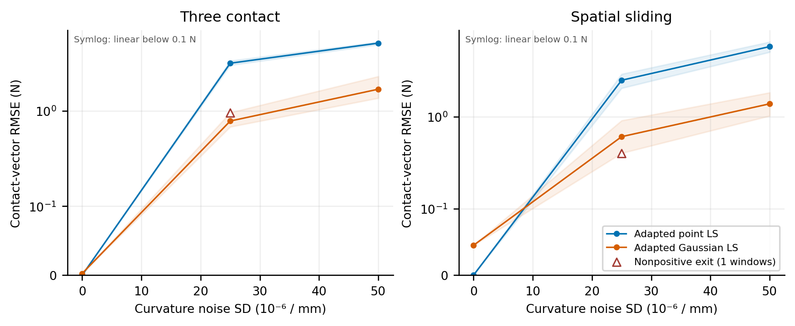
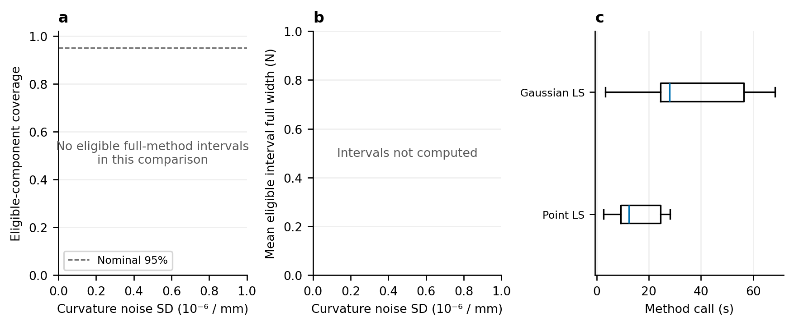

# 完整三维窗口因素实验

实际完成 36 次方法/观测包运行；run `205ff3bd-a98d-4512-a9c1-43802278a3ee`。

每个固定两帧条件内有三个独立种子，标准化噪声跨等级/同尺寸场景共用，clean 控制相同。均值按种子计算，阴影是种子最小/最大值，不是置信区间。纵轴为 symlog，0.1 N 以下线性；叉号为观测拟合复核，空心三角标记非正最终退出（重叠控制的数量见图例）。接触数不匹配的窗口不进入接触误差均值，数量明确列出；总合力误差保留。

| 场景 | 噪声 SD /mm | 方法 | 有效窗口/全部 | 接触 RMSE 均值 / N | 总合力 RMSE 均值 / N | review 帧 | 非正退出窗口 | 覆盖分子/分母 | 未辨识分量 |
|---|---:|---|---:|---:|---:|---:|---:|---:|---:|
| spatial_sliding | 0 | Adapted Gaussian LS | 3/3 | 0.0449574 | 0.0647806 | 6 | 0 | 0/0 | 0 |
| spatial_sliding | 2.5e-05 | Adapted Gaussian LS | 3/3 | 0.607036 | 0.709738 | 1 | 1 | 0/0 | 0 |
| spatial_sliding | 5e-05 | Adapted Gaussian LS | 3/3 | 1.3819 | 1.59106 | 0 | 0 | 0/0 | 0 |
| spatial_sliding | 0 | Adapted point LS | 3/3 | 4.22866e-07 | 6.30015e-07 | 0 | 0 | 0/0 | 0 |
| spatial_sliding | 2.5e-05 | Adapted point LS | 3/3 | 2.49059 | 2.65526 | 0 | 0 | 0/0 | 0 |
| spatial_sliding | 5e-05 | Adapted point LS | 3/3 | 5.78531 | 4.51738 | 0 | 0 | 0/0 | 0 |
| three_contact | 0 | Adapted Gaussian LS | 3/3 | 0.00244729 | 5.27513e-07 | 0 | 0 | 0/0 | 0 |
| three_contact | 2.5e-05 | Adapted Gaussian LS | 3/3 | 0.77969 | 1.00374 | 1 | 1 | 0/0 | 0 |
| three_contact | 5e-05 | Adapted Gaussian LS | 3/3 | 1.67974 | 2.1246 | 0 | 0 | 0/0 | 0 |
| three_contact | 0 | Adapted point LS | 3/3 | 2.8625e-07 | 4.50086e-07 | 0 | 0 | 0/0 | 0 |
| three_contact | 2.5e-05 | Adapted point LS | 3/3 | 3.14187 | 2.14717 | 0 | 0 | 0/0 | 0 |
| three_contact | 5e-05 | Adapted point LS | 3/3 | 5.10319 | 4.29345 | 0 | 0 | 0/0 | 0 |

局部区间尚未包含接触模式混合或模型标定误差；有相关分量和相邻帧，不将其作为独立 Bernoulli 样本。没有由此建立 SOTA 或实时性。

