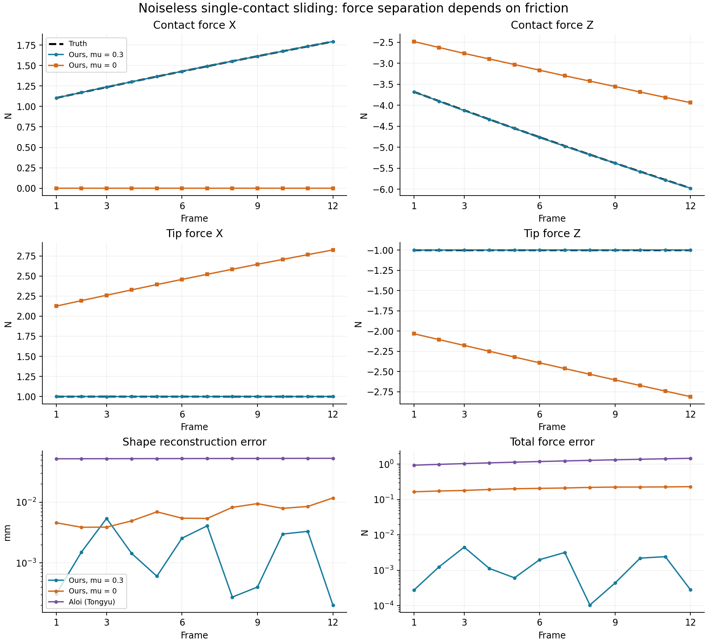
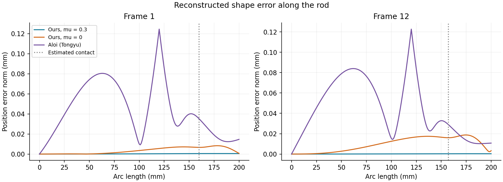

# Noiseless sliding: current method, friction ablation, and Aloi

Date: 2026-10-06. Run: `single_contact_mu_20261006`. This is a measured replay of the current implementations, not a change to the estimator formulation.

## Result

The correct friction coefficient recovers contact and tip loads to millinewton accuracy. Setting only the estimator coefficient to zero still converges, but moves the missing friction into a biased tip load and a weaker contact normal. The shape stays close to truth; the curvature residual does not. Every zero-friction frame raises `fbg-mismatch`. Tongyu's Aloi implementation returns a distributed-load resultant, not separate contact and tip estimates.

| Method | Contact force RMSE (N) | Tip force RMSE (N) | Total force RMSE (N) | Shape RMS (mm) |
|---|---:|---:|---:|---:|
| Ours, mu = 0.3 | 0.003394 | 0.001750 | 0.002022 | 0.002538 |
| Ours, mu = 0 | 2.211476 | 2.084279 | 0.206709 | 0.007145 |
| Aloi, Tongyu implementation | Not exposed | Not exposed | 1.218194 | 0.052329 |

Force RMSE is sqrt(mean over frames of squared 3D error norm). Shape RMS pools squared 3D position error over the common rod nodes and all 12 frames. It is not mean per-frame RMS. Total force is contact plus tip for ours and the integrated Gaussian resultant for Aloi. These totals have the same physical units, but do not imply matching force parameterizations.





## Controlled inputs and unchanged settings

- The existing `sliding_clean.mat` has 12 frames and 24 FBG locations, measuring two bending components. True sliding friction is 0.3 in both of our replays. The mu = 0 run is a deliberately incorrect inference model on the same frictional data, not regenerated frictionless truth.
- Measured bending samples match truth exactly; maximum difference is zero. Plane points and normals also match truth exactly. No noise was added. Nonzero likelihood/prior covariances remain: FBG standard deviation 1e-6/mm, environment position standard deviation 0.03 mm and normal-component standard deviation 0.001. These are assumed uncertainty scales, not realized noise.
- Stage 1 uses the existing reconstruction and MATLAB `lsqnonlin`, trust-region-reflective; PCHIP reconstruction was not replaced. Unmeasured twist retains the existing intrinsic/calibrated assumption. The synthetic fixture is planar; the general solver was not reduced to 2D.
- Stage 2 uses our existing semismooth SQP and exact circular friction projection, state/sensitivity IVPs, and recurrent force priors. Contact normal and arc length come from Stage 1. No new within-step correction loop or acceptance criterion was introduced. Diagnosis only reports.
- Geometry: max 30 iterations / 300 evaluations; function 1e-8, optimality 1e-6, step 1e-8. Mechanics: max 60 SQP iterations / 300 trials, QP max 200, stationarity 1e-5, terminal moment 1e-5 N mm, contact projection 1e-6 N, gap 1e-5 mm, complementarity product 1e-5 N mm. IVP relative/absolute tolerances 2e-8 / 2e-10.
- Force/tip prior standard deviations 35/4 N; process standard deviations 10/2 N at reference period 0.02 s. Diagnostic FBG whitened RMS threshold 4; tangency threshold 0.001. Full unchanged settings and dependency hashes are in metadata.json.
- Each of our two deterministic repetitions resets tracking at frame 1 and then advances all frames sequentially. Only `mu` in the current and previous sensor packets changes. All numerical outputs checked between repetitions agree to 1e-10. Stage 1 arcs and normals are identical across coefficients.
- Aloi uses Tongyu's unchanged `estimate_aloi_gaussian_baseline` and `measurements_from_sensor_packet`; its settings match `run_fair_baseline_protocol`: 15 center seeds, width seeds [3,8,16,30] mm, 2 optimizer starts, amplitude bound 100 N, position scale 0.2 mm, max 25 optimizer iterations / 180 function evaluations, inner equilibrium max 15 iterations and 0.001 mm tolerance with relaxation 0.5. Its lsqnonlin function/step tolerances are 1e-9/1e-8.

## Timing and convergence

| Quantity, mean per frame unless stated | Ours mu = 0.3 | Ours mu = 0 | Aloi |
|---|---:|---:|---:|
| Full estimator seconds | 0.1520 | 0.1640 | 7.0401 |
| Geometry seconds | 0.1033 | 0.1018 | Not separated |
| Mechanics seconds | 0.0463 | 0.0600 | Not separated |
| Diagnosis seconds | 0.0018 | 0.0016 | Different diagnostics |
| Geometry iterations | 4.58 | 4.58 | Not applicable |
| SQP iterations | 2.92 (2-3) | 4.00 | Not SQP |
| QP inner iterations | 50.92 | 67.00 | Not applicable |
| Winning optimizer start iterations | Not applicable | Not applicable | 7.08 |
| State IVPs | 1.92 | 3.00 | No shooting IVP |
| Sensitivity-augmented IVPs | 2.92 | 4.00 | No shooting IVP |
| Full-rod mechanics IVP evaluations | 4.83 | 7.00 | Not comparable |
| Segmented ode45 calls | 14.50 | 21.00 | Not used |
| Mechanics ODE RHS calls | 1801.0 | 2594.5 | Not comparable |
| Repeated `solveShape` integrations | Not this integration scheme | Not this integration scheme | 2675.42 |

Our timing is the second full replay; the first cold frame took 1.1983 s. Aloi's unprofiled full sequence took 84.4809 s plus 0.0395 s sensor preparation, divided by 12 above. Its API does not expose per-frame unprofiled times or summed optimizer iterations over both starts. The recorded first winning-start iteration count is 26 despite the configured maximum 25; this is retained as returned, not rewritten. These timings have different warmup protocols and are not a statistically controlled paper-level speedup claim.

A separate Aloi profiling replay took 107.1067 s and counted 24 `lsqnonlin` calls, 2,128 nonlinear Gaussian shape predictions, and 32,105 `solveShape` calls. The profiled time is excluded from the timing comparison. Inner fixed-point shape updates dominate the repeated work. Its shape integrations are not equivalent in dimension or cost to our 15-state / 150-state augmented ODE integrations, and our IVP counts exclude Stage 1 kinematic reconstruction. One counted IVP is a complete rod evaluation, internally split at contacts/material changes; physics.csv also reports the actual segmented ode45 call counts. No rejected mechanics trial was recorded in either of our replays. Geometry is now the largest part of our single-contact step (~0.103 s versus ~0.046 s mechanics with correct friction). The current ~0.15 s step is slower than the 0.02 s reference period.

All 12 mechanics solves converged for each coefficient. Aloi returned positive solver exit flags (10 at 3 and 2 at 2), and all final equilibrium checks passed. Its Gaussian width hits the 3 mm lower bound in every frame. Solver termination is not an accuracy guarantee. Aloi fits one transverse Gaussian load and uses a different segment integration convention from our Cosserat solve; this comparison characterizes the current code and settings, not all possible implementations of Aloi's method.

## Physics and diagnostics

| Maximum/range across frames | Ours mu = 0.3 | Ours mu = 0 |
|---|---:|---:|
| Whitened FBG RMS range | 0.021-0.418 | 8.866-18.432 |
| Penetration into inferred plane (mm) | 2.02e-07 | 3.85e-06 |
| Contact projection residual (N) | 1.19e-07 | 9.18e-10 |
| Absolute normal-tangent dot product | 0.000216 | 0.000679 |
| Terminal moment norm (N mm) | 7.42e-06 | 1.52e-08 |
| Diagnostic flags | None | FBG mismatch, all 12 |

The unchanged diagnostics also check friction-cone excess, complementarity product and positive friction work; no such flags appear. Saved per-contact values are in physics.csv. Zero friction satisfies its assumed friction law while failing the observations: the model can be mechanically feasible and physically incorrect for the real frictional interaction. A finite plane estimate remains even for noiseless data: the estimated contact arc differs from truth by at most 0.005777 mm. Truth-plane penetration at common output nodes reaches 0.000388 mm with mu = 0.3 and 0.000373 mm with mu = 0. This is separately labelled; it is not the dense inferred-plane diagnostic.

## Why friction changes the forces much more than the shape

At fixed Stage 1 geometry, eliminate base-moment variations using the linearized terminal-moment condition. Convert the resulting measurement Jacobian into physical world-force coordinates ordered [tip X,Y,Z; contact X,Y,Z], all in N. This leaves a 48-by-6 map G from force perturbations to observed bending curvature. No force priors are included in this measurement-only sensitivity.

Its six singular values are nonzero; condition numbers are 98.19-111.75. Tip-X and contact-X columns have cosine correlation 0.9708-0.9777. Thus this is a finite weak force-separation direction, not an exact singularity. Restricting force perturbations to the tangent space of the actual fixed-mu contact constraints leaves three directions and condition numbers 15.27-15.74. These are different-dimensional maps: the comparison illustrates how a known contact law removes weak freedoms, not a proof of jointly identifying unknown mu.

For a quantitative counterfactual, remove the estimated tangential contact force, then adjust tip XYZ and the contact normal amplitude to minimize the linearized FBG error while preserving active gap and terminal moment. This predicts the zero-friction compensation without rerunning an optimizer. Predicted and actual shape-change RMS use the identical collision mesh:

| First-frame quantity | Linear prediction | Actual nonlinear difference, mu=0 minus mu=0.3 |
|---|---:|---:|
| Tip X change (N) | 1.125440 | 1.125416 |
| Tip Z change (N) | -1.034075 | -1.033463 |
| Shape-change RMS (mm) | 0.004391 | 0.004360 |

Across all frames, the largest tip-change prediction error is 0.002515 N. Compensation reduces the curvature mismatch caused by simply deleting friction by 28.4-35.3 times. It does not eliminate it. This explains both the almost identical positions and the large, flagged curvature mismatch relative to the tight noiseless likelihood scale.

In frame 1 the true forces are contact [1.10373,0,-3.67909] N and tip [1,0,-1] N. With zero friction they become approximately contact [0,0,-2.48107] N and tip [2.12554,0,-2.03354] N. Contact X is about 8e-6 N rather than exactly zero because the inferred normal has a tiny tilt. All Y components remain at numerical zero; there was no imposed 2D restriction in our estimator.

The beam-moment identity also explains the coupling: upstream of contact, m(s) = (pc-p(s)) x Fc + (pL-p(s)) x Ftip. Exchanging force between tip and contact can produce a much smaller change in bending than in either force alone, especially along directions close to the free-segment chord. Shape position is an integrated observation and is still less sensitive. A good reconstructed shape is insufficient evidence for correct force separation.

Independent sequential runs at mu=0.29 and 0.31 give a first-frame central difference dFtip/dmu = [-4.9531,0,4.1973] N per unit mu. A coefficient change of +0.01 therefore corresponds locally to about [-0.0495,0,0.0420] N tip change, while the shape changes by only about 0.000446 mm RMS. All perturbed solves converge without flags. Later-frame finite differences vary substantially (shape sensitivity 0.045-0.925 mm per unit mu), so these are finite perturbations of the recurrent estimator at current stopping tolerances, not a verified infinitesimal derivative. Full rows are retained rather than smoothing this variation away.

## Interpretation and limits

This clean single-contact case is well behaved when friction is specified correctly, but still sensitive to force-model mismatch. Keeping mu is essential for load decomposition here. Dropping it is not a harmless simplification merely because the shape looks right. The existing FBG diagnostic catches the ablation under the current tight covariance. Realistic noise may mask part of that discrepancy; no robustness or unknown-mu identifiability claim follows from this noiseless experiment. Shape-objective changes, noise sweeps, better mu calibration, and altered solver settings are future decisions, not implemented here.

## Reproduction and provenance

From the package directory in MATLAB R2025b with Optimization Toolbox and the documented baseline dependencies:

```matlab
setenv('TSFS_RUN_ID','single_contact_mu_20261006');
setup_tsfs;
run_single_contact_comparison('ours');
run_single_contact_comparison('aloi');
analyze_single_contact_mu;
run_single_contact_comparison('profile');
export_single_contact_evidence;
```

Then `python experiments/single_contact/summarize_single_contact.py --run-id single_contact_mu_20261006` (NumPy and Matplotlib). Raw MAT files and logs remain under `results/runs`, ignored by Git; compact CSV/JSON evidence and plots are published under `results/published/single_contact_mu_20261006`. Source provenance in metadata.json records the directly called baseline files. The estimator core, collaborator checkout and external dependency were not modified.
